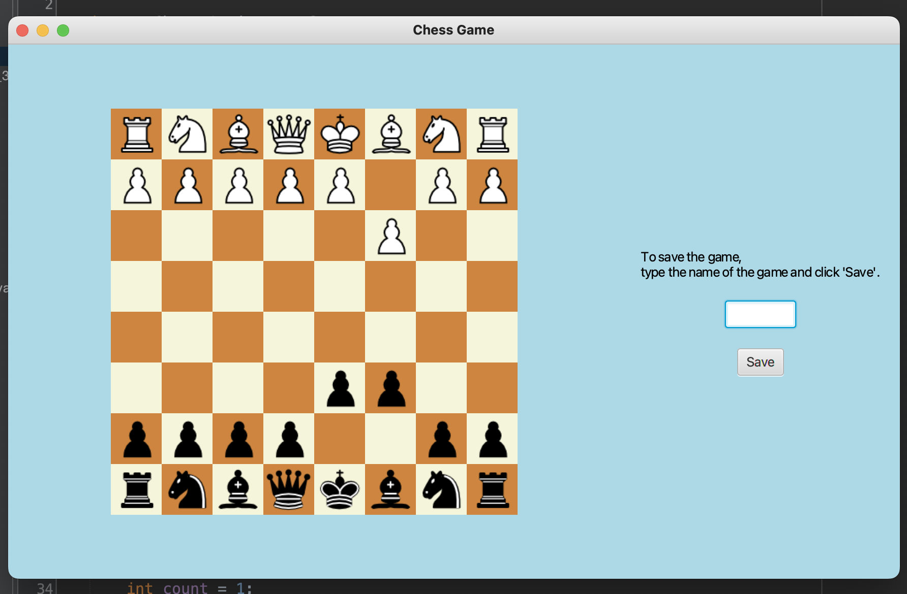

# Object-Oriented-Chess-Application

Below is the complete, emoji-free, and professional **README.md** content. You can copy the text from the box below and paste it directly into your GitHub repository.

---

# Object-Oriented Chess Application

This project is a fully functional chess application developed using Java and JavaFX. It utilizes Object-Oriented Programming (OOP) principles to manage complex game logic and provides a persistent gaming experience through state-saving capabilities.

## Project Overview

The application features an interactive chessboard GUI where players can move pieces using coordinate-based inputs or drag-and-drop functionality. A key feature of this project is its ability to save the game state to memory and disk after every move, allowing players to resume their progress at any time.

## Key Features

* Interactive GUI: Built with JavaFX, featuring a dedicated chessboard interface and custom piece assets.
* OOP Architecture: Each chess piece (Pawn, Rook, Knight, Bishop, Queen, King) is implemented as a separate class inheriting from a base abstract Piece class.
* Game Persistence: Integrated SaveAndLoad system using Java Serialization API to store piece positions and turn counts in .ser files.
* Advanced Logic: Support for standard chess rules including move validation, castling, en passant, and checkmate detection.

## Technical Implementation Details

### 1. Object-Oriented Design

The core of the application is built on Inheritance and Polymorphism.

* Abstract Base Class: The Piece class serves as a blueprint, containing shared properties like coordinates and color.
* Method Overriding: Each specific piece (e.g., Bishop.java, Knight.java) overrides the canMove(int newX, int newY) method. This allows the Game controller to validate moves dynamically without knowing the specific type of the piece at runtime.

### 2. Move Validation Logic

The logic handles several layers of verification:

* Boundary Checks: Ensures moves stay within the 8x8 grid.
* Path Obstruction: For sliding pieces like the Queen, Rook, and Bishop, the code iterates through the path to ensure no other pieces are blocking the move.
* Friendly Fire Prevention: Validates that the destination square is either empty or occupied by an opponent's piece.

### 3. State Management (Save and Load)

Instead of using a simple text file, this project implements the Java Serialization API:

* Persistence: The entire Piece[][] board array and the turnCount are serialized into a .ser binary file.
* Recovery: When a game is loaded, the application reconstructs the object graph, restoring the exact state of the board and ensuring the game continues exactly where it left off.

## Technical Stack

* Language: Java
* GUI Framework: JavaFX
* Data Management: Java Serialization
* IDE: NetBeans (Recommended)

## Project Structure

Project Structure
Piece.java: The abstract base class for all chess pieces, defining core attributes and movement contracts.

Board.java: Manages the 8x8 grid, initial piece placement, and the visual representation of the board.

Game.java: The main controller handling the game loop, turn management, and user input processing.

SaveAndLoad.java: Implements Java Serialization to handle saving and loading game states to/from disk.

Rook.java: Specific implementation of horizontal and vertical movement logic for the Rook.

Bishop.java: Specific implementation of diagonal movement logic for the Bishop.

Knight.java: Logic for the unique L-shaped movement of the Knight.

Queen.java: Combined logic for both diagonal and straight-line movements.

King.java: Movement validation for the King, including one-square radius constraints.

Pawn.java: Complex logic for Pawn movements, including forward steps and diagonal captures.

## Installation and How to Run

1. Download the Project:
* Download the repository as a ZIP file named: Object-Oriented-Chess-Application-main.zip
* Extract the ZIP file to a folder on your local machine.

2. Prerequisites:
* Ensure you have the Java Development Kit (JDK) installed.
* IMPORTANT: Ensure that you have the JavaFX SDK installed and configured on your system before attempting to run the project.

3. Open in NetBeans:
* Launch NetBeans IDE.
* Go to File > Open Project and select the extracted folder.

4. Library Configuration:
* If the project shows missing dependencies, right-click the project in the sidebar.
* Go to Properties > Libraries.
* Add your local JavaFX JAR files to the Classpath/Modulepath.

5. Execution:
* Locate Game.java in the source packages.
* Right-click the file and select Run File.
* Follow the prompts to start a new game or load a save.

## Developer

Can Zorlu
Project Duration: September 2024 - December 2024

## User Interface

  

